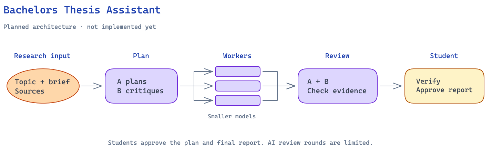

# Bachelors Thesis Assistant

A project for learning LangGraph by building a bachelor's thesis assistant for Computer Science students.

The long-term goal is to help students organize sources, develop research plans, and review source-grounded drafts. Students remain responsible for verifying and editing the final work.

## Project Status

The current prototype demonstrates workflow control using Python functions and fixed rules.

It supports input validation, bounded outline revision, checkpointing, and interactive student review. It does **not** use language models, process research sources, or generate a thesis report yet.

## Current Features

- Validate the research title and description.
- Prepare a research brief and a basic outline.
- Check whether the outline contains a `Methodology` heading.
- Add the missing heading within a configurable automatic revision limit.
- Pause execution for student review.
- Resume with the student's decision and feedback.
- Require non-empty feedback when an outline is rejected.
- Prepare a revision request containing the current outline and student feedback.
- Support the demo commands `add results` and `add discussion`.
- Prevent duplicate sections.
- Review updated outlines and present them to the student again.
- Limit student revisions independently from automatic revisions.
- Stream node updates and inspect workflow state.

## Current Workflow

1. Validate the title and description. Invalid input ends the run.
2. Prepare a brief and generate a basic outline.
3. Review the outline and revise it automatically while attempts remain.
4. Ask the student to review the outline, including when the automatic revision limit has been reached.
5. If the student approves, finish.
6. If the student rejects, collect feedback and prepare a revision request.
7. Apply a supported change, review the updated outline, and ask the student again.
8. Stop if feedback is unsupported, the requested section already exists, or the student revision limit has been reached.

Reaching `END` means execution has finished; it does not necessarily mean the outline was approved.

## Planned Architecture

This diagram shows the intended architecture, not the current implementation.



[Editable Excalidraw diagram](docs/diagrams/planned-architecture.excalidraw)

The planned system uses two larger models to propose and critique plans, smaller models to perform scoped tasks, and student checkpoints to guide the work. Agreement between models does not replace verification against sources.

## Run Locally

Developed using Python 3.13 and LangGraph 1.2.12.

### Clone the repository

```bash
git clone https://github.com/AbdelrahmanElsawy404/Bachelors-Thesis-Assistant.git
cd Bachelors-Thesis-Assistant
```

### Create and activate a virtual environment

On macOS or Linux:

```bash
python3 -m venv .venv
source .venv/bin/activate
```

### Install dependencies and run

```bash
python -m pip install -r requirements.txt
python main.py
```

No API key is required for the current prototype.

Edit the `inputs` dictionary inside `main()` to change the example research topic or revision limits.

## Demo Usage

When the workflow pauses, enter one of these decisions:

- `approved`: finish the run.
- `rejected`: provide feedback and request a change.

Supported feedback commands:

| Command | Action |
| --- | --- |
| `add results` | Add a `Results` heading before `Conclusion`. |
| `add discussion` | Add a `Discussion` heading before `Conclusion`. |

Decisions and feedback commands are matched without regard to capitalization or surrounding whitespace. The original feedback text is retained after trimming surrounding whitespace.

For example:

```text
Enter student decision (approved/rejected): rejected
Enter your feedback (add results / add discussion): add results

...the outline is updated and reviewed again...

Enter student decision (approved/rejected): approved
```

The commands add headings only. They do not generate section content or interpret free-form requests.

### Revision Limits

| Setting | Default | Purpose |
| --- | --- | --- |
| `max_revisions` | `2` | Maximum automatic outline revisions. |
| `max_student_revisions` | `2` | Maximum successful student-requested revisions. |

Unsupported requests and duplicate sections do not increase the student revision counter. The student revision limit is checked before processing the requested change.

### Student Revision Status

| Status | Meaning |
| --- | --- |
| `pending` | No student revision has been attempted yet. |
| `updated` | A requested section was added successfully. |
| `unsupported` | The feedback did not match a supported command. |
| `unchanged` | The requested section already exists. |
| `limit_reached` | The student revision limit has been reached. |

`student_revision_status` describes the latest revision attempt, not the student's approval decision. It can remain `updated` after the student approves.

The state tracks these separately:

- `outline_approved`: whether the outline passed the automatic demo check.
- `student_decision`: the student's latest decision.
- `student_feedback`: the student's latest feedback.
- `revision_request`: the outline and feedback captured for the latest requested revision.

## Checkpointing and Human Review

The graph uses `InMemorySaver` with a thread ID to retain state while waiting for student input.

The terminal interaction resumes execution through `Command(resume=...)` using the same configuration. After each resume, the program reads the latest state to determine whether another student review is pending.

Checkpoints exist only while the Python process is running. Restarting the script starts a fresh session.

The final `snapshot.next` is empty when no graph steps remain.

## LangGraph Concepts Practiced

- Shared state with `TypedDict`
- Nodes and partial state updates
- Normal and conditional edges
- Graph compilation and execution
- Streaming node updates
- Bounded review and revision loops
- Checkpointing with `InMemorySaver`
- Thread IDs and state inspection
- Human-in-the-loop review with `interrupt`
- Resuming execution with `Command`
- Repeated pause/resume cycles
- Independent automatic and student revision limits

## Current Limitations

- Outline generation and revision use fixed rules.
- Automatic review only checks for a `Methodology` heading.
- Student feedback supports two exact demo commands.
- Unsupported feedback ends the run instead of requesting clarification.
- Sources, citations, and factual claims are not processed or verified.
- State is not persisted between program runs.
- Interaction is currently limited to the terminal.

## Planned Features

- Connect a language model for outline generation and revision.
- Process papers and other sources provided by the student.
- Preserve source references and connect claims to supporting passages.
- Use two larger models to propose and critique research plans.
- Delegate scoped tasks to smaller worker models.
- Review worker outputs through bounded discussion.
- Escalate unresolved disagreements to the student.
- Produce source-grounded drafts for student verification and editing.
- Export a student-approved report.

## Author

**Abdelrahman Elsawy**

- [GitHub](https://github.com/AbdelrahmanElsawy404)
- [LinkedIn](https://www.linkedin.com/in/abdelrahman-elsawy-053952407/)
- [Portfolio](https://abdelrahman-portfolio-bla.pages.dev/)
