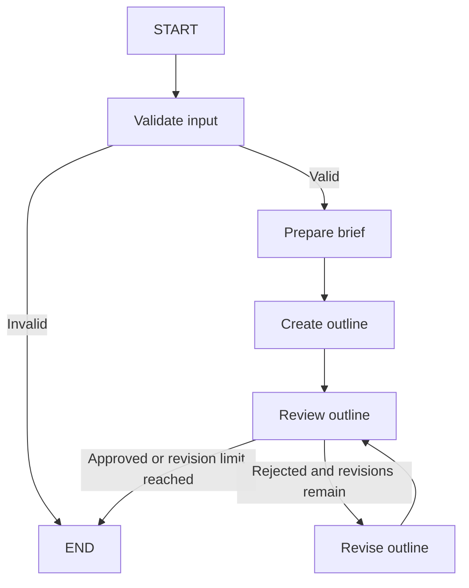

# Bachelors Thesis Assistant

A project for learning LangGraph by building a bachelor's thesis assistant for Computer Science students.

The goal is to help students organize research, work with sources, and review section drafts. The current prototype demonstrates workflow control using ordinary Python functions and fixed rules.

## Current Features

- Validate the research title and description.
- Report missing input with clear error messages.
- Prepare a research brief and a basic outline.
- Review whether the outline includes a Methodology heading.
- Revise the outline with a configurable revision limit.
- Stream node updates to the terminal.

The current version does not use language models or process research sources yet.

## Workflow



Reaching END means execution has finished. The `outline_approved` field indicates whether the outline passed the demo review.

## Run Locally

Developed using Python 3.13 and LangGraph 1.2.12.

Clone the repository:

```bash
git clone https://github.com/AbdelrahmanElsawy404/Bachelors-Thesis-Assistant.git
cd Bachelors-Thesis-Assistant
```

Create and activate a virtual environment on macOS or Linux:

```bash
python3 -m venv .venv
source .venv/bin/activate
```

Install dependencies and run:

```bash
python -m pip install -r requirements.txt
python main.py
```

Edit the example `inputs` dictionary in `main.py` to try different titles, descriptions, and revision limits.

## LangGraph Concepts Practiced

- Shared state with TypedDict
- Nodes and partial state updates
- Normal and conditional edges
- Graph compilation and execution
- Streaming updates
- Review loops with bounded revisions

## Planned Features

- Process papers and sources provided by the student.
- Use two larger models to propose and critique a research plan.
- Delegate tasks to smaller worker models.
- Review worker results through bounded discussion between the larger models.
- Escalate unresolved disagreements to the student.
- Propose source-grounded section drafts for the student to verify and edit.