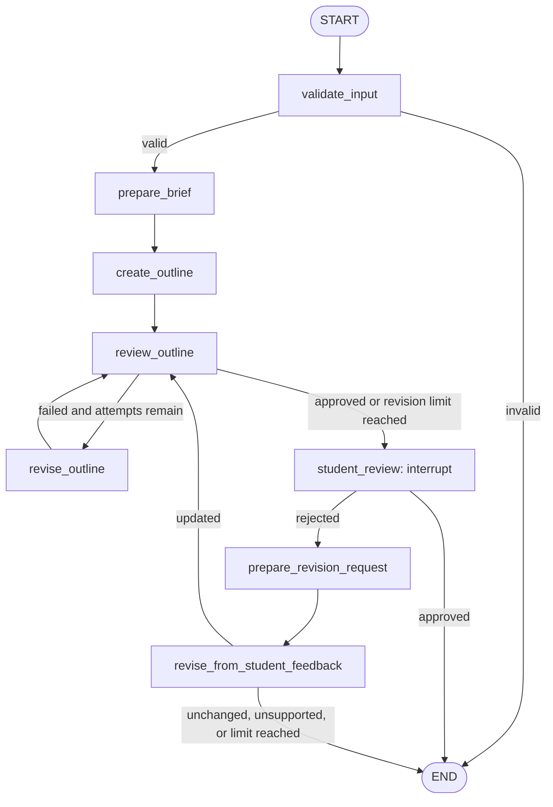
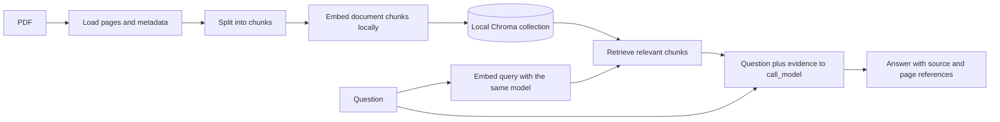

# Architecture

This document describes the implemented application and the agreed direction for
the Bachelors Thesis Assistant. Sections marked **planned** are not implemented.

## Purpose and status

The goal is to help Computer Science students turn a research topic and sources
into a plan, tasks, and evidence-backed drafts with human review. The intended
final report is at least 15 pages; university requirements still need to be
defined. Report generation and export are planned.

The current application is a Python 3.13 CLI that generates an outline with a
selected model, checks it with Python rules, and pauses for student feedback.
LangGraph manages execution and in-memory checkpoints. There is currently no
source retrieval, model-based critic, worker coordination, or web API.

A separate `try_rag.py` experiment now reads PDF pages into LangChain `Document`
objects with source metadata. It is not yet connected to the application graph.

## Current code organization

The application uses a flat Python package, `thesis_assistant`.

| File | Responsibility |
| --- | --- |
| `main.py` | Entry point; calls `cli.main()`. |
| `thesis_assistant/cli.py` | CLI arguments, demo inputs, runtime configuration, checkpointer, streaming, and student resume loop. |
| `thesis_assistant/state.py` | `ResearchState`, the shared workflow data contract. |
| `thesis_assistant/graph.py` | Registers nodes and edges and compiles the graph with an injected checkpointer. |
| `thesis_assistant/nodes.py` | Input validation, brief preparation, outline generation, rule-based review and revisions, and student interrupt. |
| `thesis_assistant/routing.py` | Chooses the next node from state values and revision limits. |
| `thesis_assistant/models.py` | CLI provider adapters, provider dispatch, response parsing, and outline validation. |
| `thesis_assistant/prompts.py` | Builds the outline prompt from the research brief. |
| `thesis_assistant/outline_schema.json` | JSON output shape requested from the model. |
| `try_codex.py`, `try_antigravity.py` | Standalone manual experiments that call the selected CLI provider. |
| `try_rag.py` | Standalone PDF-loading experiment using `PdfReader` and LangChain `Document` objects. |
| `requirements.txt` | Pins the current dependencies: `langgraph`, `langchain-core`, and `pypdf`. |
| `docs/ai_software_testing.pdf` | Local sample research paper used by the RAG experiment; excluded from Git. |
| `docs/diagrams/` | Architecture illustrations; the existing planned-architecture image describes future work. |

The main dependency direction is `main → cli → graph → nodes/routing`.
Nodes use state definitions, prompt construction, and model adapters. Provider
adapters do not decide workflow routing.

## Current workflow

- Input validation checks that the title and description are not blank. The CLI
  currently supplies a hardcoded research example.
- `create_outline` builds a prompt, calls the configured provider with the JSON
  schema, validates the response, and stores newline-separated section titles.
- `review_outline` only checks for an exact `Methodology` line. Automatic revision
  inserts that line before `Conclusion`. Since response validation already
  requires `Methodology`, this revision branch is normally bypassed after a valid
  model response. It is a learning example, not a research-quality review.
- `student_review` pauses with `interrupt`. The CLI resumes with
  `Command(resume=...)` using the same graph and thread configuration.
- Student revisions support `add results` and `add discussion`. They insert the
  requested section before `Conclusion`; they do not call a model.
- Both revision limits are currently 2. Reaching the automatic revision limit
  sends the outline to the student without implying approval. Unsupported,
  duplicate, or exhausted student revisions end the run without applying a change.

### State and configuration

`ResearchState` contains the research input, brief, outline, validation results,
review feedback, student decision, and separate automatic/student revision counts
and limits. `revision_request` is prepared as text but is not currently consumed
by a model; student revisions use `student_feedback` directly.

Runtime configuration supplies `thread_id`, `planner_provider`, and
`planner_model`. The CLI uses the fixed demo thread ID `demo-1` and an
`InMemorySaver`. Checkpoints support pause/resume within the running process;
they are lost when that process ends.

## Current model boundary

`call_model(prompt, provider, model, schema_path=None)` dispatches to a provider
adapter and returns text. The CLI exposes `--planner-provider` and
`--planner-model`; only the outline-generation role is configurable today.

| Provider | Executable | Default model in the code |
| --- | --- | --- |
| Codex | `codex exec` | `gpt-6-astra` |
| Antigravity | `agy` | `gemini-3.8-flash-medium` |

Adapters use authenticated CLI sessions via `subprocess.run`, with captured
output, exit-code checking, and a 180-second timeout. Access depends on the
user's selected provider, account, and available models.

- Codex receives the prompt on stdin, uses a read-only sandbox and ephemeral
  session, and receives `--output-schema` when a schema is supplied.
- Antigravity returns a JSON envelope. The adapter requires `status=SUCCESS` and
  uses `structured_output` for schema requests or `response` for plain text.
- The outline parser requires exactly one `sections` field. It checks nonempty,
  unique, single-line titles; the required `Introduction`, `Background`,
  `Methodology`, and `Conclusion` titles; and `Conclusion` as the last title.
- Prompt rules also request `Introduction` first and no surrounding whitespace;
  those two rules are not fully enforced by the current validator.

Provider and parsing failures currently propagate out of the main application.
The standalone experiments catch selected errors. Automatic retries and recovery
routes are not implemented. Prompts ask models not to use tools or inspect or
modify files; prompt instructions alone are not an execution sandbox.

## RAG: implemented loading and planned retrieval

**Decision:** use LangChain components for document retrieval and LangGraph for
workflow control. Develop and evaluate a standalone one-PDF experiment before
integrating it into the application graph.

| Packages | Responsibility | Status |
| --- | --- | --- |
| `langchain-core` | `Document` objects containing text and source metadata; also supplies `RunnableConfig` for the application. | Implemented |
| `pypdf` | Read PDF pages with `PdfReader`; create one `Document` per page. | Implemented in `try_rag.py` |
| `langchain-text-splitters` | Chunking with `RecursiveCharacterTextSplitter`. | Planned |
| `langchain-huggingface`, `sentence-transformers` | Local embeddings through `HuggingFaceEmbeddings`. | Planned |
| `langchain-chroma`, `chromadb` | Persistent local vector storage and retrieval. | Planned |
| `langgraph` | Connect retrieval and generation to the existing workflow. | RAG integration planned |

The loading experiment uses the 31-page paper *Software Testing with Large
Language Models: Survey, Landscape, and Vision*, stored locally at
`docs/ai_software_testing.pdf`. Each `Document` stores page text and metadata:
`source`, zero-based `page`, and `total_pages`. Extraction falls back to an empty
string when no text is returned. Text order and table extraction still need
quality checks before relying on the content as evidence.

`langchain-core` and `pypdf` are now declared in `requirements.txt`. The experiment
uses `pypdf` directly instead of `PyPDFLoader` from the discontinued
`langchain-community` package. See the
[official sunset announcement](https://github.com/langchain-ai/langchain-community/issues/674).
PyMuPDF remains an alternative to evaluate if extraction quality requires it.
The embedding model, chunk settings, and retrieval settings are still to be
chosen and evaluated. The diagram below shows the target RAG flow; only page
loading has been implemented so far.

Document ingestion runs when sources are added or changed. Question answering
reuses the stored collection. Each retrieved chunk should retain its source,
page reference, and a stable identifier so claims can be traced to evidence.
Changing the embedding model requires rebuilding the corresponding embeddings.

The first version will always retrieve before generating. A LangGraph node can
format the retrieved documents and pass them to the existing `call_model`
function. This design uses local embeddings and existing CLI access for answer
generation; it does not require adding a paid embedding API.

Before graph integration, evaluate questions with and without answers in the
PDF. Check retrieval relevance, answer support, and citation accuracy. High
similarity alone does not prove a chunk answers the question. Insufficient
evidence should produce an explicit limitation rather than an invented answer.
Source text must be treated as evidence, not as instructions for the workflow.

## Planned planning, execution, and critique

The target workflow has three model roles plus the student. Each role should
allow provider/model selection within supported integrations and actual user
access. Current model preferences are not architectural requirements, and the
desired critic model's availability has not been confirmed.

1. **Planner A** creates a plan from the brief and available evidence.
2. **Critic B** reviews and discusses the plan with A before worker execution.
3. **Workers** execute small, agreed tasks and return outputs with source references.
4. **Planner A** reviews worker outputs and requests revisions when needed.
5. When A considers the work complete, **Critic B must review both the output and
   A's reasons for accepting it**.
6. Agreement on revisions returns tasks to workers. Agreement on completion
   prepares the result for student review.
7. Persistent disagreement or an exhausted discussion limit triggers a student
   interrupt containing both positions and their reasons.

RAG will provide evidence for these roles. Agreement between models does not
verify a source or establish that a claim is supported. Evidence checks and
student review remain necessary parts of the design.

## Implementation sequence

1. **Completed in the standalone experiment:** load a PDF and inspect page text and metadata.
2. Split pages into chunks and inspect overlap and source preservation.
3. Create local embeddings and persist a Chroma collection.
4. Test retrieval independently of generation.
5. Generate answers with citations and evaluate supported/unsupported questions.
6. Integrate the tested RAG functions into LangGraph nodes and state.
7. Add model-based planning, critique, worker execution, and disagreement handling.
8. Add report assembly and student-approved export.

Persistent workflow checkpoints and a web interface/API can be considered when
the application needs them. Chroma persistence stores retrieval data; it does not
replace LangGraph checkpoint persistence.
